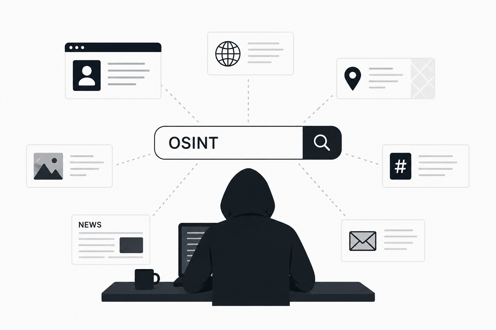

# OSINT_probiv_list
OSINT каталог и подборка Telegram-ботов для пробива и поиска информации: проверка номера телефона, поиск по Telegram, никнейму, email, фото, IP и автомобилям. Инструменты для анализа цифрового следа, поиска аккаунтов и проверки данных человека.

# 🔍 Поиск информации о человеке: номер телефона, Telegram, аккаунты и данные

Сегодня практически у каждого человека есть цифровой след. Мы используем тг, регистрируемся в сервисах, оставляем контакты — и со временем эта информация начинает пересекаться.

Из-за этого появляется вопрос: как понять, кто перед тобой. Кто-то ищет это как проверку номера телефона, кто-то как поиск по Telegram, а кто-то пытается найти человека по нику или аккаунтам. Иногда используют слово «пробив», но по сути речь идёт об анализе открытых данных.

---

## 📌 Что можно проверить

С помощью открытых источников можно искать информацию по:

* 📱 номеру телефона
* 💬 Telegram (логин, ID)
* 👤 нику / юзернейму
* 🌐 соцсетям
* 📧 email
* 📸 фото
* 🚘 авто

👉 чем больше исходных данных — тем выше шанс найти совпадения

---

## 🔥 Инструменты для поиска информации

👉 обычно начинают именно с инструментов, потому что уже после первых проверок становится понятно, есть ли зацепки

* 📲 [**Void**](https://t.me/zarovadkbot)
* 📲 [**Funstat**](https://t.me/dara_kartybot)
* 📲 [**Dyxless**](https://t.me/sonner_windenbot)
* 📲 [**Sherlock**](https://t.me/vidjakinabot)
* 📲 [**Enigma**](https://t.me/setov_temybot)
* 📲 [**Himera**](https://t.me/mid_elektronnyjbot)

👉 лучший результат даёт комбинация нескольких сервисов

---

## 📱 Проверка номера телефона

Один из самых популярных сценариев — узнать, кому принадлежит номер.

👉 для проверки номера чаще всего используют:

* 📲 [Void](https://t.me/zarovadkbot)
* 📲 [Dyxless](https://t.me/sonner_windenbot)
* 📲 [Himera](https://t.me/mid_elektronnyjbot)

Что можно найти:

* связанные аккаунты
* профили в соцсетях
* упоминания
* цифровые следы

👉 если номер где-то использовался, это может дать зацепки

---

## 💬 Поиск по Telegram

Telegram — один из основных источников информации.

👉 для анализа тг-аккаунтов используют:

* 📲 [Funstat](https://t.me/dara_kartybot)
* 📲 [Void](https://t.me/zarovadkbot)
* 📲 [Sherlock](https://t.me/vidjakinabot)

Можно проверить:

* username
* ID
* активность
* участие в чатах

👉 часто один и тот же аккаунт связан с другими сервисами

---

## 👤 Поиск по нику

Если есть username, его можно проверить в разных сервисах.

👉 для поиска по нику:

* 📲 [Sherlock](https://t.me/vidjakinabot)
* 📲 [Enigma](https://t.me/setov_temybot)
* 📲 [Dyxless](https://t.me/sonner_windenbot)

Это позволяет:

* найти дополнительные аккаунты
* понять, где используется этот ник
* собрать общий профиль

👉 одинаковые ники часто ведут к одному человеку

---

## 🌐 Поиск по соцсетям

Соцсети содержат большое количество открытых данных.

👉 чаще всего используют:

* 📲 [Dyxless](https://t.me/sonner_windenbot)
* 📲 [Void](https://t.me/zarovadkbot)
* 📲 [Sherlock](https://t.me/vidjakinabot)

Можно найти:

* профили
* фотографии
* посты
* активность

👉 иногда достаточно одного совпадения, чтобы выйти на нужный аккаунт

---

## 🌐 Поиск по дополнительным данным (фото, email, авто)

Не всегда у тебя есть номер телефона или Telegram. Часто остаются только косвенные данные: фотография, почта или информация об автомобиле. Но даже этого бывает достаточно, чтобы найти зацепки, если правильно использовать доступные источники.

👉 в таких случаях используют:

* 📲 [Dyxless](https://t.me/sonner_windenbot)
* 📲 [Void](https://t.me/zarovadkbot)
* 📲 [Himera](https://t.me/mid_elektronnyjbot)
* 📲 [Enigma](https://t.me/setov_temybot)

### 📸 Поиск по фото

Фотография — это одна из самых сильных зацепок, потому что изображения часто публикуются в разных источниках. Даже если у тебя нет номера или ника, фото может уже где-то появляться, и через это можно выйти на дополнительные профили.

Что обычно удаётся найти:

* совпадения в интернете
* страницы в соцсетях
* повторное использование фото
* признаки фейкового аккаунта

👉 особенно хорошо работает, если изображение уже публиковалось ранее

---

### 📧 Проверка email

Email — это стабильный идентификатор, который редко меняется и часто используется при регистрации. Поэтому через него можно собрать довольно много информации, даже если других данных нет.

Через почту можно определить:

* связанные аккаунты
* используемые сервисы
* утечки данных
* совпадения с другими профилями

👉 иногда один email даёт больше зацепок, чем номер телефона

---

### 🚘 Проверка авто

Информация об автомобиле — не самый очевидный источник, но в некоторых случаях он даёт дополнительные связи. Особенно это полезно, если есть номер или VIN.

Что можно проверить:

* упоминания в интернете
* историю автомобиля
* возможные связи с владельцем
* дополнительные зацепки

👉 чаще всего используется не отдельно, а как дополнение к другим данным

---

## 📊 Как это использовать вместе

Самая частая ошибка — проверять только один параметр. На практике такой подход редко даёт результат, потому что данные разбросаны по разным источникам.

Гораздо эффективнее комбинировать:

* номер телефона + Telegram
* ник + соцсети
* email + аккаунты
* фото + профили

👉 именно связка нескольких источников чаще всего даёт результат

---

## 🔎 Как проходит поиск

Обычно процесс выглядит одинаково: сначала берётся исходный контакт, затем он проверяется через разные инструменты, после чего ищутся совпадения и постепенно расширяется информация.

Основные шаги:

* выбор исходных данных (номер, ник, аккаунт)
* проверка через сервисы
* поиск совпадений
* расширение информации

👉 важно не останавливаться на первом результате

---

## 📊 Почему результаты отличаются

Разные сервисы используют разные базы данных и источники, поэтому результат может отличаться. Это нормально, и именно поэтому не стоит ограничиваться одним инструментом.

На практике:

* один сервис ничего не покажет
* другой даст нужную зацепку

👉 поэтому всегда лучше проверять несколькими способами

---

## 📌 Как увеличить шанс результата

Чтобы повысить вероятность найти информацию, важно подходить к поиску шире и не зацикливаться на одном методе.

Рабочий подход:

* использовать несколько инструментов
* проверять разные типы данных
* делать повторные проверки

👉 часто результат появляется не сразу

---

## ⚠️ Ограничения

Иногда информации просто нет. Если человек не оставляет цифровых следов или старается их скрывать, поиск может не дать результата.

👉 это нормальная ситуация

---

## ❓ FAQ

Можно ли узнать чей номер?
Иногда да, если есть совпадения.

Как найти человека?
Через анализ открытых источников и сопоставление данных.

Как проверить аккаунт?
Через активность, связи и дополнительные зацепки.

---

## ⚖️ Дисклеймер

Материал представлен в образовательных целях. Использование должно соответствовать законодательству.

---

## 🏷 SEO

Ключевые запросы:

В тексте и разделах охватываются основные направления OSINT и поиска информации через открытые источники: пробив по номеру телефона, пробить номер телефона, узнать чей номер, проверить номер телефона, кто звонил и как найти владельца номера. Рассматриваются способы поиска информации о человеке, включая пробив человека по номеру телефона, проверку данных и анализ цифрового следа.

Отдельное внимание уделяется поиску по мессенджерам, в частности Telegram: пробив по тг, пробить телеграм, проверка аккаунта тг, поиск по Telegram, анализ активности и поиск сообщений. Также затрагиваются методы поиска по нику и юзернейму — пробив по нику, поиск по username, анализ аккаунта и выявление связанных профилей.

В материале рассматриваются сценарии поиска по социальным сетям: пробив вк, пробив инстаграм, поиск профилей, анализ соцсетей и поиск аккаунтов человека. Дополнительно описаны методы работы с email — проверка email, поиск по почте, анализ утечек данных и поиск аккаунтов, связанных с электронной почтой.

Также охватываются альтернативные способы поиска: пробив по фото, поиск по фотографии, анализ изображений, пробив по IP, определение IP-адреса, а также проверка автомобилей — пробив авто, проверка по VIN, госномер и история автомобиля.

Дополнительно рассматриваются популярные инструменты и сервисы: глаз бога, осинт боты, Telegram-боты для поиска информации, OSINT-инструменты, а также методы автоматизации поиска данных через API и анализ информации в интернете.

Материал ориентирован на пользователей, которые ищут способы пробить номер телефона, проверить аккаунт, найти человека по различным данным и понять, какие данные доступны в открытых источниках.
